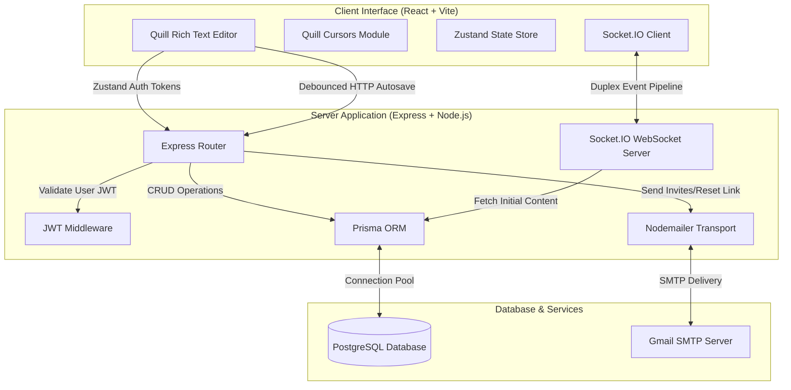
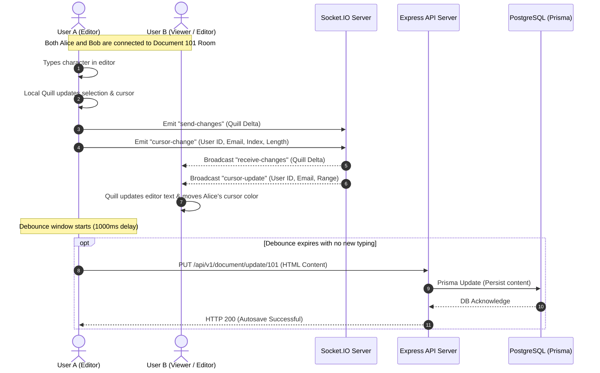
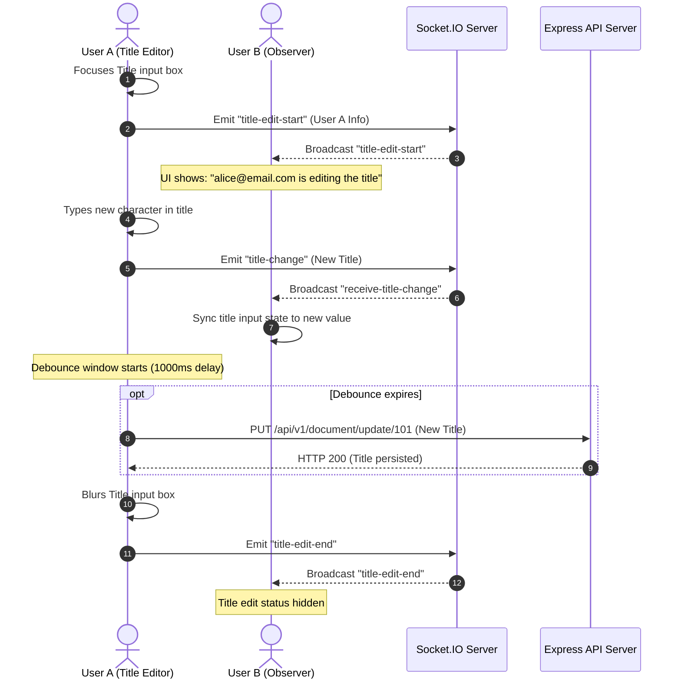

# RealTimeDocs — Collaborative Document Platform

RealTimeDocs (also referred to as **Docify**) is a production-grade, full-stack, real-time collaborative document platform inspired by Google Docs. It allows multiple users to simultaneously edit documents with live cursor tracking, instant text and title synchronization, granular sharing permissions, and robust transactional email workflows.

The system is designed with a decoupled client-server architecture, utilizing WebSockets for low-latency operational sync and a debounced database persistence engine to ensure PostgreSQL scale-stability.

---

## Technical Architecture Overview

RealTimeDocs uses a React single-page application client and a Node.js/Express server. Real-time duplex communication is handled by Socket.IO, while data persistence is managed through PostgreSQL and the Prisma ORM.

### System Architecture



### Real-Time Text Editing & Autosave Workflow

The platform separates fast, collaborative UI updates from slow database storage operations to maximize performance.



### Collaborative Title Editing Workflow

The document title input supports real-time editing status to prevent title overwrite collisions.



---

## Core Features

*   **Real-Time Collaborative Editing**: Simultaneous document editing using operational data structures (Quill Deltas) broadcasted over WebSockets via Socket.IO.
*   **Dynamic Cursors (`quill-cursors`)**: Live rendering of collaborator cursor positions and text selections inside the editor canvas. Every collaborator is dynamically assigned a unique color from a centralized theme palette.
*   **Active Presence Indicators**: Live navigation bar avatars showing connected users currently inside the document workspace. Includes responsive layouts displaying dropdown lists for smaller screen viewports.
*   **Collaborative Title Editing**: Status indicators signaling which user is actively renaming the document to avoid conflicts.
*   **Granular Sharing Permissions**: Document owners can share access with other registered users, granting either `VIEW` (read-only) or `EDIT` (read-write) permissions.
*   **State-Saving Autosave Pipeline**: Debounced delta transmission which updates database records in a PostgreSQL database 1000ms after user interaction stops.
*   **Email Verification & Verification Lifecycle**: Sign-up flow requiring account verification via signed verification tokens delivered through transactional SMTP email.
*   **Password Recovery System**: Fully secure, time-limited tokenized email reset cycle validating password equality during recovery.
*   **Client State Optimization**: Zustand-driven state store providing clean separation of UI states (active selectors, share panels) from core network payloads.
*   **Zod Validator Middleware**: Express endpoint requests are validated using schema parsing for error prevention.

---

## Tech Stack

### Frontend (`/client`)
*   **Core**: React 19, TypeScript 5.8
*   **Build Utility**: Vite 7
*   **Styling**: Tailwind CSS v4
*   **State Management**: Zustand 5
*   **Collaborative Editor**: Quill 2 (Snow theme) + `quill-cursors`
*   **Real-Time Transport**: Socket.IO Client 4.8
*   **Utilities**: Axios (HTTP Client), React Router DOM 7 (Routing), `jwt-decode` (JWT token expiration inspection)

### Backend (`/server`)
*   **Core**: Node.js, Express 5, TypeScript 5.8
*   **ORM**: Prisma 6
*   **Database**: PostgreSQL
*   **Real-Time Transport**: Socket.IO 4.8
*   **Authentication & Hashing**: JSON Web Tokens (JWT), `bcrypt`
*   **Email Engine**: Nodemailer (Gmail SMTP integration)
*   **Validation**: Zod 3
*   **Hot-Reload Tooling**: `ts-node-dev`

---

## Project Structure

```
RealTimeDocs/
├── client/                     # React Single Page Application (SPA)
│   ├── src/
│   │   ├── assets/             # Brand and logo image resources
│   │   ├── components/         # Reusable presentation and layout components
│   │   │   ├── Body.tsx        # Document listing workspace & filters
│   │   │   ├── DocumentCard.tsx # Individual document tile layout
│   │   │   ├── DocumentNavbar.tsx # Collaboration navbar (User list, Share modal)
│   │   │   ├── Navbar.tsx      # Main application dashboard navigation bar
│   │   │   ├── QuillEditor.tsx # Core collaborative editing canvas with Socket.IO
│   │   │   └── ShowShare.tsx   # User lookup and access control modal
│   │   ├── css/                # Quill custom styling overrides
│   │   ├── interfaces/         # Unified TypeScript interfaces
│   │   ├── pages/              # Routed view container pages
│   │   │   ├── Document.tsx    # Collaborative editor page
│   │   │   ├── Home.tsx        # Main Document Dashboard Page
│   │   │   ├── Password.tsx    # Password recovery UI page
│   │   │   ├── Signin.tsx      # User authentication login page
│   │   │   ├── Signup.tsx      # User account signup form
│   │   │   └── Verify.tsx      # Email verification verification page
│   │   ├── protectedRoutes/    # Layout wrapper checking JWT status
│   │   ├── services/           # Axios network configurations & wrappers
│   │   └── store/              # Zustand global store & color mapping logic
│   └── package.json            # Client-side configuration and dependencies
│
└── server/                     # Node.js + Express backend application
    ├── src/
    │   ├── actions/            # MVC Controller actions (documents, users)
    │   ├── interfaces/         # Custom TypeScript type overrides
    │   ├── middleware/         # Security validation and JWT checks
    │   ├── routes/             # REST route collections
    │   ├── validate/           # Input constraints written in Zod
    │   ├── index.ts            # Core Express application entry point
    │   ├── nodemailer-config.ts # Nodemailer email client setup
    │   └── server.ts           # Socket.IO orchestrator and HTTP Server boot
    ├── prisma/
    │   ├── migrations/         # Local DB migration history logs
    │   └── schema.prisma       # Prisma data model definition
    └── package.json            # Server-side configuration and dependencies
```

---

## Database Design

The data layer represents relationships between users, documents, and shared users. The database schema uses three models:

```prisma
model User {
  id           Int            @id @default(autoincrement())
  name         String
  email        String         @unique
  password     String
  isVerified   Boolean?       @default(false)
  documents    Document[]     // Documents owned by the user
  documentuser Documentuser[] // Joint table: Documents shared with this user
}

model Document {
  id           Int            @id @default(autoincrement())
  title        String?
  content      String?        // HTML text structure containing document editor content
  updatedAt    DateTime       @updatedAt
  userId       Int            // ID of the owner
  user         User           @relation(fields: [userId], references: [id])
  documentuser Documentuser[] // Shared access connections
}

enum Permission {
  VIEW
  EDIT
}

model Documentuser {
  id         Int        @id @default(autoincrement())
  userId     Int
  docId      Int
  permission Permission
  user       User       @relation(fields: [userId], references: [id])
  document   Document   @relation(fields: [docId], references: [id], onDelete: Cascade)
}
```

*   A **User** is the system actor who owns multiple documents and accesses documents shared by others.
*   A **Document** contains the rich text structure inside the `content` field. When deleted, it cascades down to clean up all related permissions.
*   **Documentuser** manages fine-grained permissions.

---

## Installation & Configuration

### Prerequisites
*   Node.js ≥ 18
*   PostgreSQL Instance
*   A Gmail account and an generated **App Password** for Nodemailer.

### 1. Clone the Repository
```bash
git clone https://github.com/anujsolania/RealTimeDocs.git
cd RealTimeDocs
```

### 2. Configure Environment Variables

Create and configure `.env` files in both client and server directories.

#### **Backend Config (`server/.env`)**
```env
PORT=3000
DATABASE_URL="postgresql://<username>:<password>@<host>:<port>/realtimedocs?schema=public"
JWT_KEY="your_jwt_signing_key_here"
VERIFICATION_KEY="your_email_verification_key_here"
RESETPASSWORD_KEY="your_password_reset_key_here"
LINK="http://localhost:5173" # URL of the client SPA
EMAIL="your_gmail_address@gmail.com"
EMAIL_PASS="your_gmail_app_password" # 16-character Google App Password
```

#### **Frontend Config (`client/.env`)**
```env
VITE_URL="http://localhost:3000" # URL of the backend API
```

### 3. Install Dependencies
```bash
# Frontend
cd client && npm install

# Backend
cd ../server && npm install
```

### 4. Database Sync & Code Generation
Configure your database connection inside `server/.env`, and run:
```bash
cd ../server
npx prisma migrate dev --name init
npx prisma generate
```

---

## Running Locally

To run the application locally, run both the backend server and frontend client.

### Start the Backend Server
```bash
cd server
npm run dev
```
The server will start and output `server is running at 3000`.

### Start the Frontend Dev Server
```bash
cd client
npm run dev
```
The client app will launch at `http://localhost:5173`.

---

## API Endpoints

All authenticated requests must include the JWT token inside the `Authorization` header (`Authorization: <JWT_TOKEN>`).

### User Routes (`/api/v1/user`)

| Method | Endpoint | Auth | Request Body | Description |
| :--- | :--- | :--- | :--- | :--- |
| `POST` | `/signup` | None | `{ name, email, password }` | Registers a new user and triggers verification email. |
| `POST` | `/signin` | None | `{ email, password }` | Authenticates user and returns JWT token & user object. |
| `PUT` | `/verifyemail/:token` | None | None | Verifies user's email via the verification token. |
| `POST` | `/forgotpassword` | None | `{ email }` | Triggers a password recovery email. |
| `POST` | `/forgotpassword/:token`| None | None | Validates password reset token validity. |
| `POST` | `/resetpassword` | None | `{ password, confirmpassword, email }`| Resets user password to new value. |
| `GET` | `/` | JWT | None | Returns the active user's username. |

### Document Routes (`/api/v1/document`)

| Method | Endpoint | Auth | Request Body | Description |
| :--- | :--- | :--- | :--- | :--- |
| `POST` | `/` | JWT | None | Creates a new blank document. |
| `GET` | `/` | JWT | None | Retrieves all documents (Owned, Shared, All). |
| `GET` | `/:documentId` | JWT | None | Fetches document details and user permission level. |
| `PUT` | `/update/:documentId` | JWT | `{ title?, content? }` | Updates document title or content structure. |
| `DELETE`| `/delete/:documentId` | JWT | None | Deletes document (restricted to document owners). |
| `POST` | `/share/:documentId` | JWT | `{ email, permission }`| Shares document with a user (`VIEW` or `EDIT`). |
| `GET` | `/getcollaborators/:documentId`| JWT | None | Lists all collaborators for the document. |

---

## Security & Authentication Flow

```
1. Guest User signs up  ==> Encrypt password (bcrypt) and send verification email
2. User clicks email link ==> Set user status to verified (isVerified: true)
3. User signs in        ==> Verify password, generate and return JWT (expires in 12 hours)
4. Authenticated Request ==> Add header: Authorization: <JWT_TOKEN>
```

*   **Socket.IO Verification**: Socket connections are authenticated. The client provides the JWT token during the handshake process:
    ```typescript
    const socketServer = io(import.meta.env.VITE_URL, {
      auth: { token: token, documentId: documentId }
    });
    ```
    The server intercepts this, validates the token using `jwt.verify`, extracts user info, and drops invalid connections immediately to prevent unauthorized access.
*   **Granular Permission Checks**: When fetching a document, the API returns the user's permission level (`VIEW` or `EDIT`). Viewers receive a read-only instance, and the client disables input and hides the editor toolbar.

---

## Technical Challenges & Engineering Tradeoffs

### 1. WebSocket Session Authentication Setup
*   *Challenge*: In standard REST structures, API authorization is stateless and validated on each request. In persistent WebSocket applications, maintaining authorization requires validation.
*   *Solution*: Connection authentication is performed during the Socket.IO connection handshake. If the JWT is expired or malformed, the connection is closed. The server then binds the verified `userId` and `email` to the socket instance, making it available for subsequent socket messages.

### 2. State-Saving Autosave Optimization
*   *Challenge*: Performing database updates on every keystroke causes heavy database write-load, which can degrade app performance.
*   *Solution*: The editor uses a client-side **Debounce** mechanism. While changes are broadcasted immediately over Socket.IO to other users (providing sub-second latency), database write operations are held back. When a user stops typing for `1000ms`, a single HTTP PUT request is sent to save the HTML content in PostgreSQL.

### 3. Serverless Environment vs. Stateful WebSockets
*   *Challenge*: Deploying real-time WebSocket applications to serverless environments (like Vercel Serverless Functions) presents challenges because serverless instances are stateless, ephemeral, and terminate long-lived WebSocket connections.
*   *Solution / Tradeoff*: RealTimeDocs includes a `vercel.json` configuration to package the Express endpoints. However, for a stable real-time workspace experience, the backend server is designed to run on persistent VPS instances (such as Render, Fly.io, or AWS EC2). This ensures that Socket.IO rooms and client maps are maintained in memory without disconnection.

---

## Future Improvements

1.  **OT-based Conflict Resolution**: Move from Quill Delta overrides to Operational Transformation (OT) or Conflict-Free Replicated Data Types (CRDTs) to resolve simultaneous keystroke conflicts.
2.  **Persistent Collaborator History**: Store collaborator session logs in a database table to show access times and change logs.
3.  **Document Exporting**: Add exporting capabilities to download files in `.pdf`, `.docx`, or `.txt` formats.
4.  **WebSocket Clustering**: Use Redis adapter for Socket.IO (`@socket.io/redis-adapter`) to scale horizontally across multiple node servers.

---

## Contributing

1.  Fork the Project.
2.  Create your Feature Branch (`git checkout -b feature/AmazingFeature`).
3.  Commit your Changes (`git commit -m 'Add AmazingFeature'`).
4.  Push to the Branch (`git push origin feature/AmazingFeature`).
5.  Open a Pull Request.

---

## License

This project is licensed under the MIT License. See [LICENSE](LICENSE) for details.
